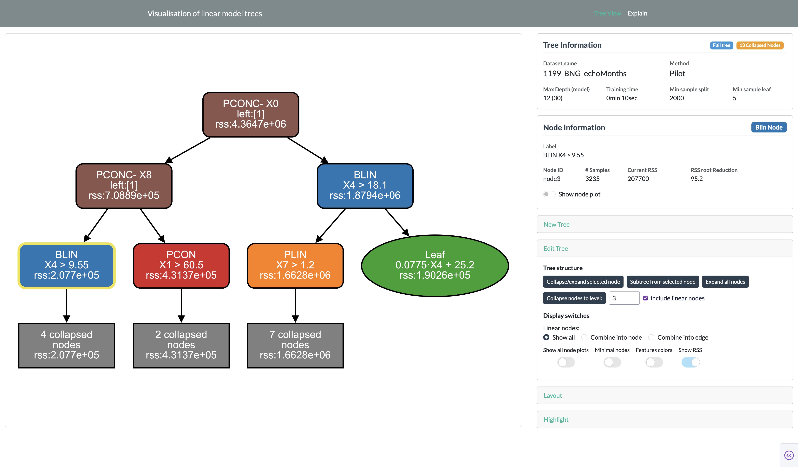
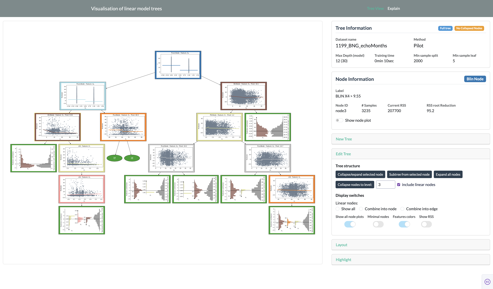
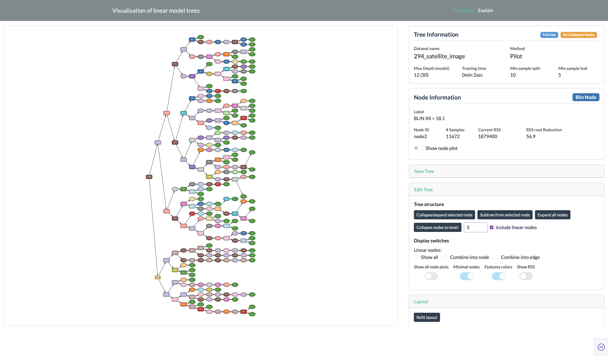
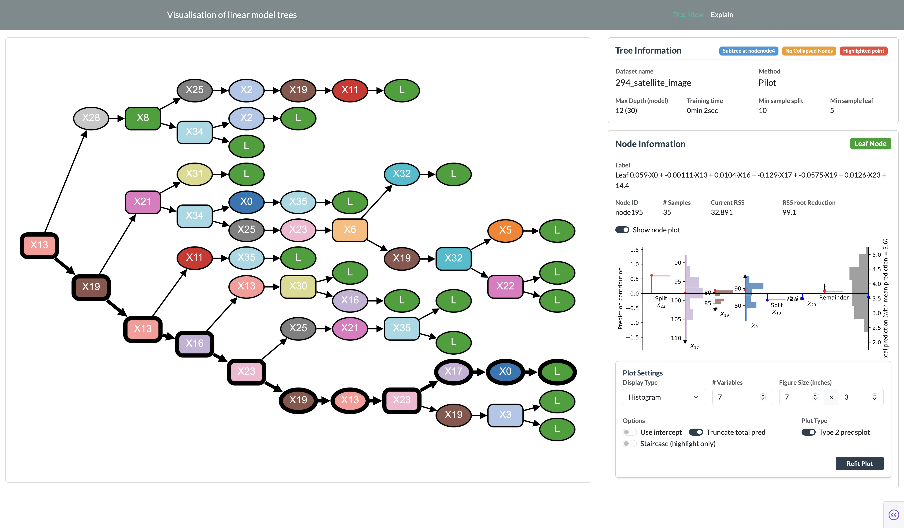
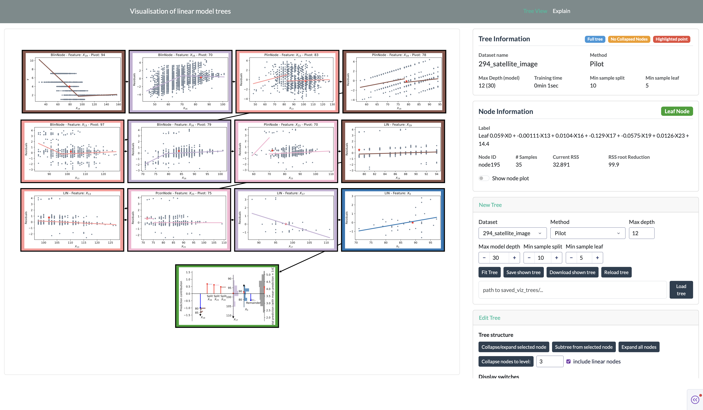
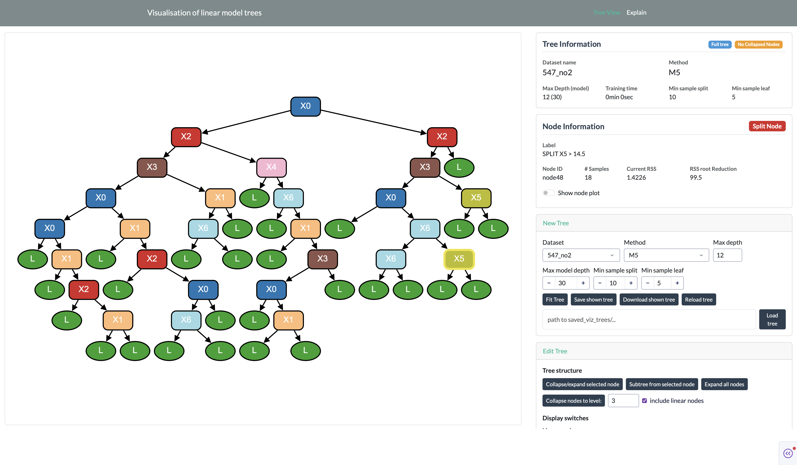

# Gallery

This page contains screenshots of the application to highlights some of the features.

## Collapsed nodes

The initially loaded PILOT tree with some collapsed nodes and the RSS enabled

---

## Show all node plots

The initially loaded PILOT tree showing all node plots.

---

## A large tree

A large PILOT tree with minimal nodes and feature colors enabled.

---

## Subtree and highlight

A subtree of the large PILOT tree above with a prediction highlighted.

---

## Show only highlighted path

The large PILOT tree above only showing the highlighted path and with show all node plots enabled. (The layout of the nodes is done manually.)

---

## M5 example

An M5 tree with minimal nodes and feature colors enabled.
