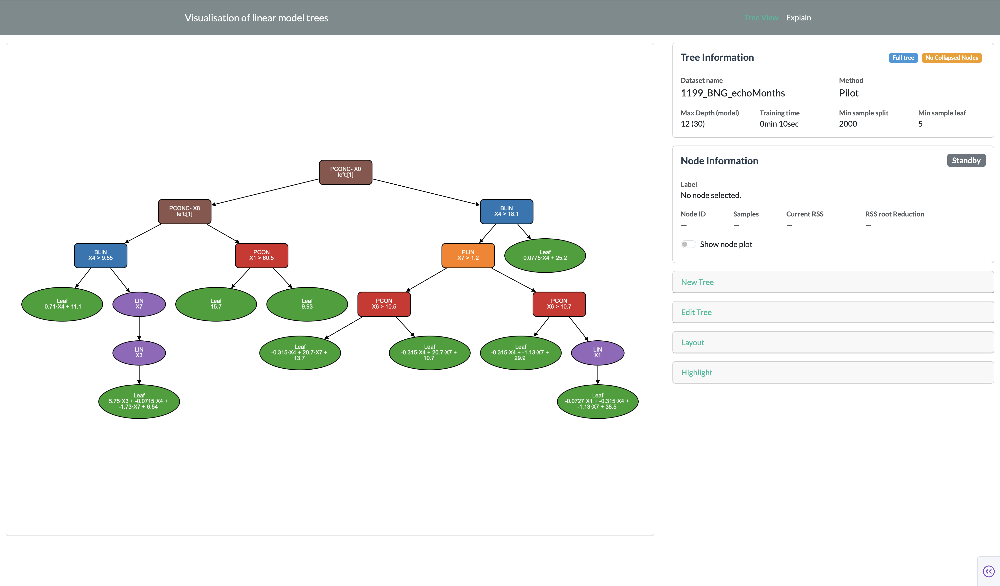

# Visualisation of linear model trees

This is an interactive application for fitting, visualizing, and exploring linear model trees **for regression**. It lets you fit a tree to a dataset, inspect its structure as an interactive graph, explore individual nodes to see how they model the data, and trace a specific data point through the tree to understand a prediction.

This application is designed for **regression on tabular data**, where the objective is to predict a continuous target value from a set of input features. Given a dataset, a regression model learns the relationship between the features and the target, allowing it to make predictions for unseen observations. Linear model trees are a type of regression model that aim to balance predictive performance with interpretability.

## What is a linear model tree?

A linear model tree combines the interpretability of a decision tree with the flexibility of linear regression: instead of predicting a single constant value in each leaf (like a CART tree), it has a linear model in each leaf, making it more flexible. This usually gives smaller, more interpretable trees for the same predictive accuracy. The application currently supports two model tree algorithms:

* **PILOT** (*PIecewise Linear Organic Tree*) — a fast, interpretable linear model tree algorithm for regression. Unlike traditional regression trees, PILOT fits linear models within the tree while preserving the intuitive, rule-based structure of decision trees. It builds the tree greedily, without pruning, making it both efficient and scalable to large datasets while remaining stable and resistant to overfitting. PILOT was the primary motivation for developing this application: although the algorithm is highly interpretable by design, there was no easy way to visualize and explore its tree structure. This application was created to make PILOT models easier to understand, explain, and analyze, allowing users to fully benefit from the interpretability offered by its design.

* **M5** — the classic linear model tree algorithm introduced by Quinlan. M5 first constructs a standard CART regression tree, after which each leaf node is replaced with a linear regression model. The resulting tree is then pruned and smoothed to improve generalization performance. Because the tree structure is created before introducing the linear models, the partitioning of the feature space does not take these models into account.

You can choose between them in the [New Tree](user-guide/c-new-tree.md) card when fitting a tree.

## What can you do in the application?

- **Fit a new tree** on a built-in dataset, or reload/save trees you've fitted before.
- **Explore the tree structure** as an interactive graph: collapse and expand subtrees, combine linear chains of nodes, and adjust the layout.
- **Inspect any node** to see its samples, RSS, and — depending on the node type — a plot with its data and fit.
- **Highlight a specific data point** to see the exact path it takes through the tree, and which leaf (and linear model) ends up making its prediction.

## Where to start

If you're new to the app, start with [Interface Overview](user-guide/interface-overview.md) for a quick tour, then you can look at [New Tree](user-guide/c-new-tree.md) to fit your first tree or look at the [gallery](gallery.md).

 The right side of the app is organized into *interaction* cards, each has its own page explaining it in more detail:

| *Interaction* Card | Purpose |
|---|---|
| [Tree Info](user-guide/a-tree-info.md) | Summary of the currently loaded tree |
| [Node Information](user-guide/b-node-info.md) | Details and diagnostic plots for the currently selected node |
| [New Tree](user-guide/c-new-tree.md) | Fit a new tree, or save/load one |
| [Edit Tree](user-guide/d-edit-tree.md) | Collapse, expand, and restyle the tree view |
| [Layout](user-guide/e-layout.md) | Control how the tree graph is laid out on screen |
| [Highlight](user-guide/f-highlight.md) | Trace a specific data point's path through the tree |

!!! note "Explain page"
    The app also has an "Explain" page. It's still under development and isn't documented yet.
