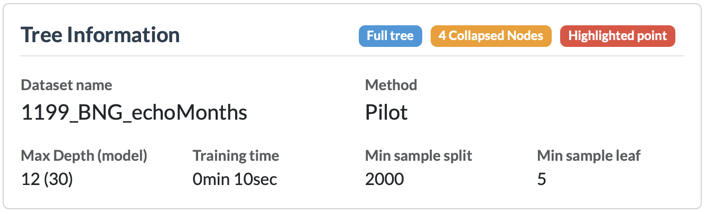

# Tree Info

The **Tree Info** card sits at the top and is always visible. It gives you a summary of the tree that's currently loaded, so you don't have to inspect individual nodes to know what you're looking at.

## What it shows

Next to the title, the card displays several status badges that provide information about the currently displayed tree:

* **Tree view** – Indicates whether you are viewing the full tree or a subtree rooted at an internal node.
* **Collapsed nodes** – Indicates whether the tree contains any collapsed nodes.
* **Highlighted point** – Indicates whether a data point is currently highlighted.

Below the badges, the following information is shown:

* **Dataset name** – The name of the dataset used to fit the tree.
* **Method** – The algorithm used to fit the tree (PILOT or M5).
* **Max depth** – The maximum model depth of the tree.
* **Max model depth**  The maximum model depth of the tree without counting the linear models (PILOT only).
* **Training time** – The time required to fit the tree.
* **Min samples split** – The minimum number of training samples a node must contain before it is allowed to be considered for splitting.
* **Min samples leaf** – The minimum number of training samples that each leaf must contain. A split is only performed if both resulting child nodes satisfy this constraint.

## When it updates

The card refreshes automatically whenever a new tree is fit, saved, or loaded via the [New Tree](c-new-tree.md) card.
