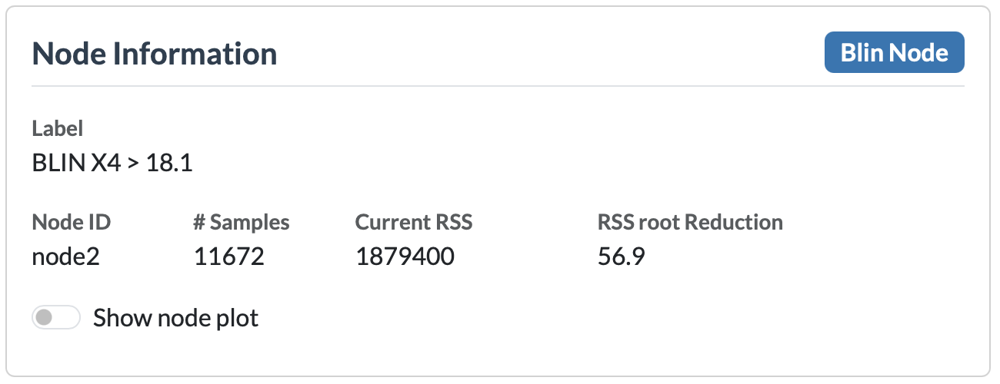
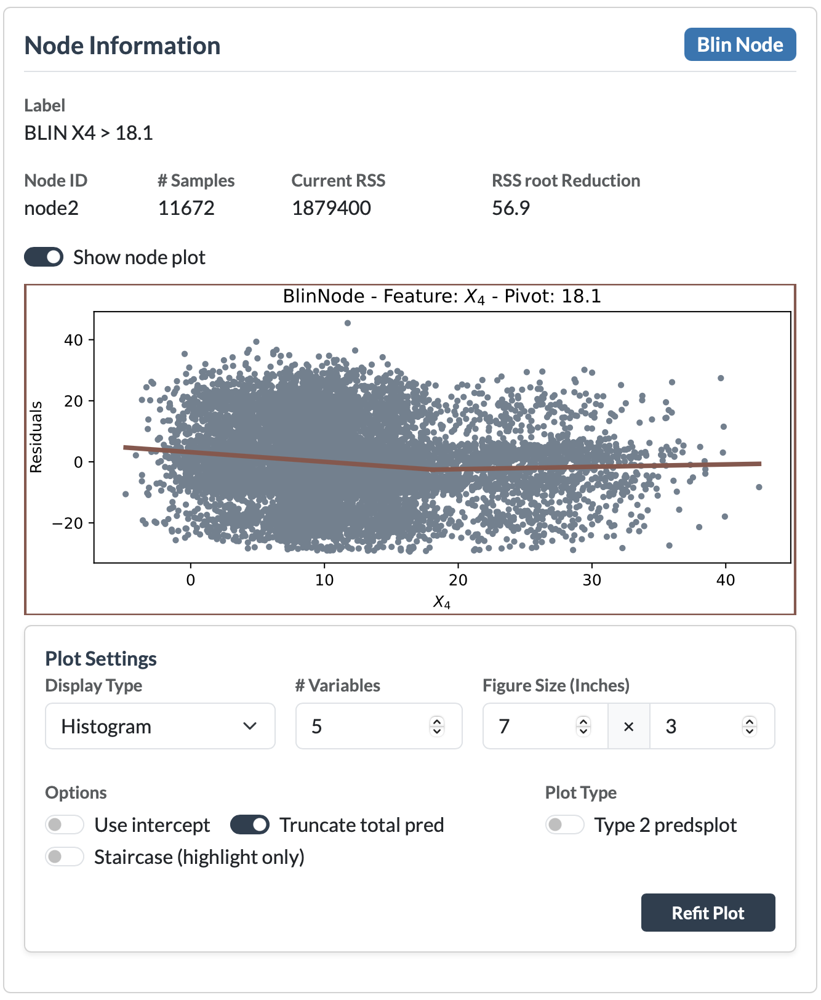
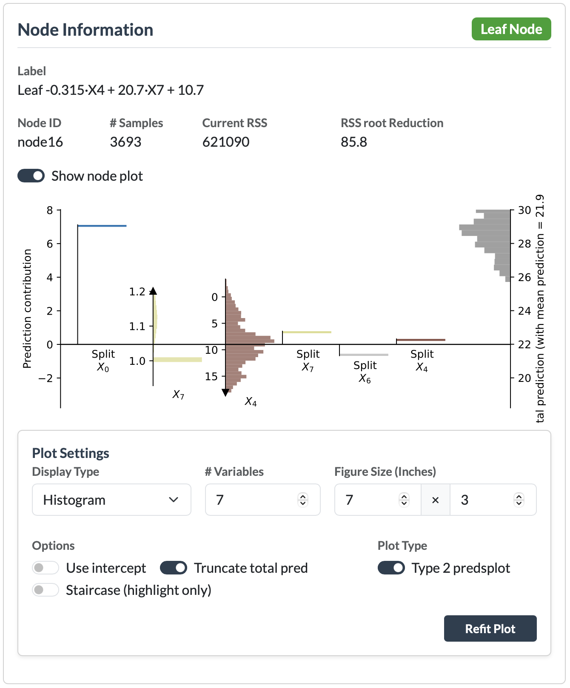

# Node Information

The **Node Information** card is always visible. It shows details about whichever node is currently selected in the graph, and (when turned on) a plot explaining what that node does.

## Selecting a node

Click any node in the graph area. The badge at the top of the card (default: "Standby") updates to reflect the type of node selected, and the fields below fill in.

## Node Badge
Each node contains a badge indicating the type of node. The available node types depend on the selected algorithm:

- **PILOT**:
    - **pcon** (*piecewise constant*) – a node with a piecewise constant prediction model.
    - **pconc** (*piecewise constant categorical*) – a node with a piecewise constant prediction model for categorical splits.
    - **lin** (*linear*) – a node containing a linear model.
    - **plin** (*piecewise linear*) – a node containing a piecewise linear model.
    - **blin** (*broken linear*) – a node containing a broken linear model.
    - **leaf** – a leaf node containing a linear regression model.
- **M5**:
    - **split** – an internal node that splits the data based on a feature value.
    - **leaf** – a leaf node containing a linear regression model.

## Node fields
Below the node type badge, the following fields are displayed:

* **Label** – A description of the node. For split nodes, this provides information about the split condition. For leaf nodes, it describes the fitted linear model.
* **Node ID** – The unique identifier of the node in the tree.
* **Samples** – The number of data points that reach this node.
* **Current RSS** – The residual sum of squares (RSS) of the model fitted at this node.
* **RSS Root Reduction** – The reduction in RSS compared to the root node, indicating how much improvement has been achieved by splitting the data.
* **Show node plot** – A switch that enables the node plot for the selected node (see below).

---

## Node plots

Enabling **"Show node plot"** displays a visualization that explains the selected node. The type of plot depends on the selected node:

* **Internal nodes** (nodes with children, i.e. split nodes) display a regression plot showing the data reaching that node and the model fitted at that point.
* **Leaf nodes** display a prediction plot, with two available variants: **Predsplot** and **Predsplot 2**. The desired variant can be selected using the setting below the plot.

### Regression plot — internal nodes

The regression plot visualizes the data that reaches the selected node and the model fitted at that node.

* The **x-axis** shows the feature variable associated with the node. This can be the feature used for splitting and/or the feature used in the linear model.
* The **y-axis** shows the response values used for fitting:
    * For **PILOT**, this represents the residuals after applying the models of all previous nodes. For the root node, no previous models exist, so the original target values are shown.
    * For **M5**, only splits are performed at internal nodes, so the y-axis represents the original target values.

The fitted model at the node is displayed as a line over the data points. The line color is linked to the corresponding feature variable and is used consistently throughout the application. The same color is used in prediction plots and in the tree visualization when feature coloring is enabled.

*Note: The regression plot for M5 models is currently not fully implemented and can show wrong results.*

When a data point is highlighted, its corresponding value is also highlighted in the node plot, provided that the point passes through the selected node.

---

### Predsplot — leaf nodes

The prediction plots visualize the data and the linear model of a selected leaf node. They provide an intuitive way to understand how the different features contribute to the final prediction made by the linear model in that leaf.

The idea of the prediction plot is based on the work of Rousseeuw:

> Rousseeuw, P. J. — *Explainable Linear and Generalized Linear Models by Means of the Predictions Plot*

A linear regression model is usually represented as a prediction formula containing input variables, coefficients, and an intercept. However, directly interpreting this formula can be difficult, especially when trying to understand which features have the largest impact or why a specific prediction is unusually high or low.

The predictions plot addresses this by transforming the model into a visual representation of feature contributions. Each feature is shown according to its contribution to the prediction, making it easier to understand the relative importance and direction of each term. The plot works directly with the fitted model, independent of how the model was obtained, and can handle both numerical and categorical variables.

In this application, the predictions plot is used to explain the linear model present in a PILOT or M5 leaf node. It shows how each feature contributes to the prediction of a selected data point relative to the average prediction within that leaf.

---

### Predsplot 2 — leaf nodes

**Predsplot 2** is an extension of the standard prediction plot that also incorporates information from the path a data point followed through the tree.

A regular prediction plot only explains the contribution of the features in the linear model of the selected leaf. However, in a linear model tree, the split decisions made before reaching the leaf also contain predictive information. Different branches of the tree can lead to leaves with substantially different average predictions, meaning that the splits themselves contribute to the final prediction.

Predsplot 2 separates these effects into two types of contributions:

* **Linear contributions** – The contribution of a feature within the linear model of the selected leaf. These correspond to the contributions shown in the regular prediction plot.
* **Split contributions** – The contribution of a feature caused by the splits along the path to the selected leaf. These represent the change in average prediction caused by following a particular branch of the tree.

Unlike the regular prediction plot, which starts from the average prediction within the selected leaf, Predsplot 2 starts from the average prediction of the complete tree (the global mean). This provides a more complete explanation of how a prediction is obtained: first through the decisions made by the tree structure, and then through the linear model fitted in the final leaf.

Predsplot 2 is therefore useful when explaining not only **what the leaf model predicts**, but also **why a data point reached this leaf and how the complete tree contributed to the final prediction**.

---

## Plot Settings

When **"Show node plot"** is enabled, a **Plot Settings** panel appears below the plot. This panel allows you to control how the visualization is rendered.

### General settings

These settings apply to both regression plots and prediction plots:

* **Figure Size** – The width and height of the rendered plot in inches.

### Prediction plot settings

The following settings are only available for prediction plots:

* **Display Type** – Controls how the data distribution is displayed in the prediction plot. Available options are:
    * **Histogram** – Displays the distribution using bars.
    * **Density** – Displays a smoothed density estimate of the distribution.
* **# Variables** – The maximum number of variables displayed in the prediction plot. If there are more, the least important ones get combined.
* **Use intercept** – Determines whether the plot uses the model intercept as the baseline instead of the leaf mean or global mean.
* **Truncate total prediction** – Truncates the density display of the total prediction. This can make the plot more compact when the prediction distribution is widely spread.
* **Staircase (highlight only)** – Only available when a data point is highlighted (see [Highlight](f-highlight.md)). Displays the cumulative feature contributions in a staircase style visualization for prediction plots.
* **Type 2 predsplot** – Switches the leaf visualization from the standard **Predsplot** to **Predsplot 2**.

After changing any settings, click **"Refit Plot"** to regenerate the visualization using the updated configuration.

!!! note "Showing all node plots"
    The [Edit Tree](d-edit-tree.md) card also contains a **"Show all node plots"** switch. When enabled, the application generates a node plot for every node in the tree and replaces the usual node labels with these plots. This can be useful for exploring the entire tree, but may take some time for large trees.

