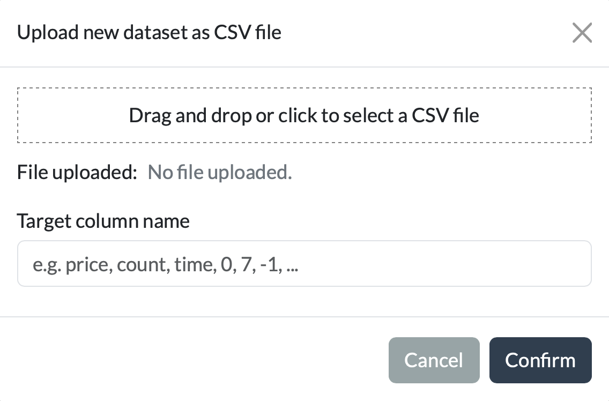

# New Tree

The **New Tree** card is used to fit a new model tree, to save and load previously fitted trees, or to load a tree with
an adapter.

## Fitting a tree

| Field                 | Description                                                                                                                                                       |
|-----------------------|-------------------------------------------------------------------------------------------------------------------------------------------------------------------|
| **Dataset**           | The dataset on which the tree will be fitted. A selection of datasets from the PMLB repository are available. A csv file with a new dataset can also be uploaded. |
| **Method**            | The model tree algorithm to use: PILOT or M5 (see the [index](../home.md) for a brief description of each).                                                       |
| **Max depth**         | The maximum depth of the tree. (The root node is at depth 0.)                                                                                                     |
| **Max model depth**   | PILOT only feauture: The maximum model depth, also counting linear nodes (max depth doesn't count linear nodes).                                                  |
| **Min samples split** | The minimum number of samples required before a node may be considered for splitting.                                                                             |
| **Min samples leaf**  | The minimum number of samples that each resulting leaf must contain.                                                                                              |

Click **Fit Tree** to train and show a new tree using the selected settings. Fitting may take a some time for larger
datasets or deeper trees.

## Saving and loading trees

The following actions are also available:

* **Save shown tree** – Saves the currently displayed tree as a pickled Python object in
  `application_dir/output/saved_viz_trees`. The saved tree can later be reloaded in the application.
* **Download shown tree** – Downloads the currently displayed tree as an SVG image.
* **Reload tree** – Restores the original fitted tree. This is useful after exploring subtrees or making temporary
  modifications to the visualization. The tree is restored to the state it had immediately after being fitted or loaded.
* **Load tree** – Loads a previously saved tree (pickled Python object). Enter the path to a saved tree in the text
  field and click **Load tree**. If no valid path is provided, the application automatically loads the most recently
  saved tree from `application_dir/output/saved_viz_trees`.

## Uploading a CSV dataset

When choosing to upload a CSV dataset, the following pop-up is shown. The uploaded dataset should be a numeric
dataframe, with one column specified as the target column. In the input field below the upload, you can specify the
target column by its name or by its index (e.g., the first or last column).

If you want to use PILOT or M5, categorical variables need to be converted to integers. Categorical variables are
automatically detected as having fewer than 8 unique values.

## Using an adapter to upload a tree

The application also allows you to upload a linear model tree using an adapter. An adapter converts a tree from an
external implementation into the internal `VizTree` object used for visualization.
Currently, adapters are available for PILOT, M5, and the _partykit_ package in R. (PILOT and M5 trees can also be
trained directly in the application.) The _partykit_ adapter supports trees fitted using `lmtree()` in R.

The documentation page of the [adapter](../home.md) explains how to implement your own adapter, allowing trees from other linear model tree
algorithms in different languages to be imported. It also provides more details on the partykit adapter.

### Using an Adapter
* Select the desired adapter from the dropdown.
* Select the dataset used to fit the tree. You can upload the dataset (or a sample) as a CSV.
* Provide the **path to the model** or file containing the tree information.
* Click on **Load with Adapter**.
