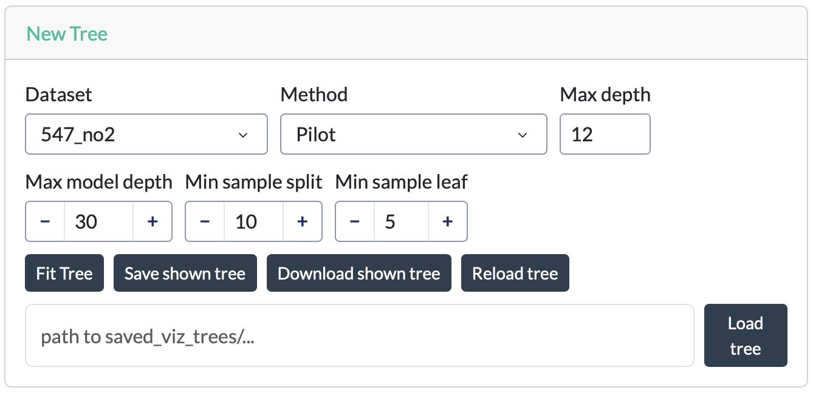

# New Tree

The **New Tree** card is used to fit a new model tree or to save and load previously fitted trees.

## Fitting a tree

| Field                 | Description                                                                                                          |
| --------------------- | -------------------------------------------------------------------------------------------------------------------- |
| **Dataset**           | The dataset on which the tree will be fitted. A selection of datasets from the PMLB repository is available.         |
| **Method**            | The model tree algorithm to use: **PILOT** or **M5** (see the [index](../home.md) for a brief description of each). |
| **Max depth**         | The maximum depth of the tree.                                                                                       |
| **Max model depth**   | The maximum model depth, excluding the linear models in the leaves (PILOT only).                                     |
| **Min samples split** | The minimum number of samples required before a node may be considered for splitting.                                |
| **Min samples leaf**  | The minimum number of samples that each resulting leaf must contain.                                                 |

Click **Fit Tree** to train and load a new tree using the selected settings. Fitting may take a few seconds for larger datasets or deeper trees.

## Saving and loading trees

The following actions are available:

* **Save shown tree** – Saves the currently displayed tree as a pickled Python object in `application_dir/output/saved_viz_trees`. The saved tree can later be reloaded in the application.
* **Download shown tree** – Downloads the currently displayed tree as an SVG image.
* **Reload tree** – Restores the original fitted tree. This is useful after exploring subtrees or making temporary modifications to the visualization. The tree is restored to the state it had immediately after being fitted or loaded.
* **Load tree** – Loads a previously saved tree. Enter the path to a saved tree in the text field and click **Load tree**. If no valid path is provided, the application automatically loads the most recently saved tree from `application_dir/output/saved_viz_trees`.
