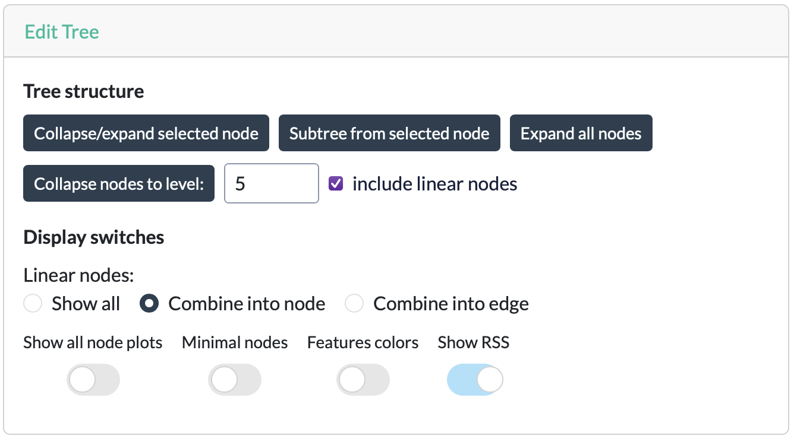

# Edit Tree

The **Edit Tree** card controls how the tree is structured and displayed in the graph — it doesn't change the underlying fitted model, only what you see.

## Tree structure

These controls determine which parts of the tree are currently visible.

| Control                           | Description |
| --------------------------------- | ----------- |
| **Collapse/Expand selected node** | Toggles whether the children of the currently selected internal node are visible. An internal node must be selected before this option can be used. |
| **Subtree from selected node**    | Displays only the subtree rooted at the selected node. All other parts of the tree are hidden. |
| **Expand all nodes**              | Expands all previously collapsed nodes. |
| **Collapse nodes to level: N**    | Collapses the tree so that only the first **N** levels remain. When **Include linear nodes** is enabled (PILOT only), linear (non-splitting) nodes are also counted when determining the collapse level. |

## Display options

| Option                           | Description |
| -------------------------------- | ----------- |
| **Linear nodes**        | Controls how chains of linear nodes are displayed in PILOT trees. Available options are **Show all** (each as its own node), **Combine into node** (merged into a single node), or **Combine into edge** (merged into the connecting edge). |
| **Show all node plots** | Displays the [node plot](b-node-info.md#node-plots) for every node simultaneously instead of only for the selected node. This can take some time for large trees. |
| **Minimal nodes**       | Uses a more compact node layout with shorter labels and smaller node sizes, making large trees easier to view. |
| **Feature colors**      | Colors nodes according to the feature associated with that node, rather than by node type. These colors are used consistently throughout the application, including in the [node plots](b-node-info.md#node-plots). |
| **Show RSS**            | Displays the residual sum of squares (RSS) in the label of every node.|

Some combinations of options are not possible, which is adjusted for automatically.
