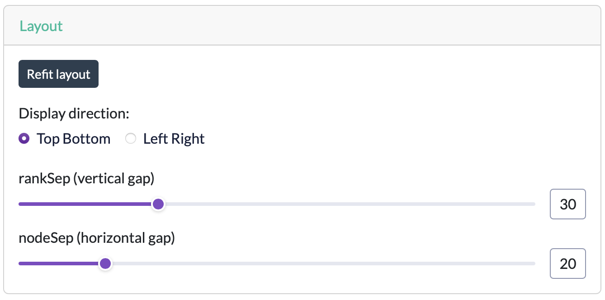

# Layout

The **Layout** card controls how the tree graph is arranged on screen. It doesn't affect the tree's structure or data, only the drawing.

## Controls

| Control | Description |
|---------|-------------|
| Refit layout | Re-runs the automatic layout, useful after dragging things around |
| Display direction | **Top Bottom** or **Left Right** - the direction the tree grows in |
| rankSep (vertical gap) | Spacing between tree levels (ranks) |
| nodeSep (horizontal gap) | Spacing between sibling nodes at the same level |

The graph uses the [dagre](https://github.com/dagrejs/dagre) layout engine, which arranges nodes level by level and tries to minimize edge crossings.

!!! warning "Dagre layout limitations"
    The Dagre layout algorithm is not always able to produce an optimal layout. For larger or more complex trees, nodes and edges may occasionally be positioned in a way that appears confusing or unintuitive. This is a limitation of the layout algorithm rather than of the underlying tree itself.
