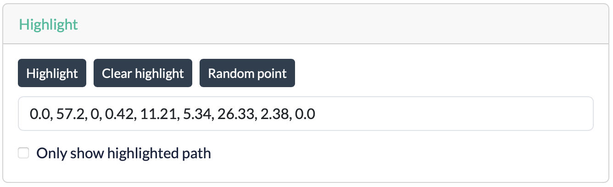

# Highlight

The **Highlight** card lets you trace the path of a specific data point through the tree. This is useful for understanding exactly how the model arrives at a prediction for a particular observation.

## Highlighting a point

1. Specify the data point to highlight:
    * Enter the feature values as a comma-separated list (for example, `1.2, 0.5, 3.1,...`). The number of values must match the number of features in the trees dataset.
    * Alternatively, click **Random point** to select a random training sample from the dataset.
2. Click **Highlight**. The path taken by the selected data point, from the root node to the predicting leaf, is highlighted in the tree.
3. Optionally enable **Only show highlighted path** to hide all other branches. This can make the highlighted path much easier to follow, especially in large trees.
4. Click **Clear highlight** to remove the highlight and return to the normal view.

!!! warning "Highlighting in subtrees"
    When viewing a subtree, the application always displays a highlighted path, even if the selected data point would not pass through that subtree in the original tree. This is a known limitation of the current implementation and should be taken into account when interpreting highlighted paths in subtree views.
