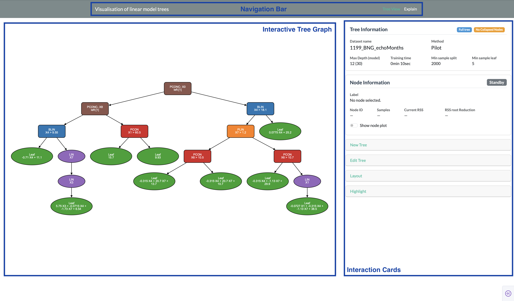

# Interface Overview

This page give a short orientation of the full application.

## Layout

The app window is split into three main areas:

- **The navigation bar**, allows you to switch between different pages (at the moment only one page, the tree view is supported).
- **The interactive tree graph**, showing the current tree as an interactive [Cytoscape](https://js.cytoscape.org/) graph. You can pan, zoom and click on or shift nodes.
- **The interaction cards**, containing a stack of (collapsible) *interaction* cards, each controlling or adjusting a different aspect the graph on the left of the stack.

## Interaction cards

The first two cards — **Tree Info** and **Node Information** — are always visible, the other cards can expanded or collapsed by clicking their header

| Interaction Card | Purpose |
|---|---|
| [Tree Info](a-tree-info.md) | Summary of the currently loaded tree |
| [Node Information](b-node-info.md) | Details and diagnostic plots for the currently selected node |
| [New Tree](c-new-tree.md) | Fit a new tree, or save/load one |
| [Edit Tree](d-edit-tree.md) | Collapse, expand, and restyle the tree view |
| [Layout](e-layout.md) | Control how the tree graph is laid out on screen |
| [Highlight](f-highlight.md) | Trace a specific data point's path through the tree |

## Selecting a node

Clicking a node in the graph area is how you select it — this drives the **Node Information** card and is a prerequisite for several actions in the **Edit Tree** card (e.g. "Collapse/expand selected node"). When a node is selected it has a yellow outline.
